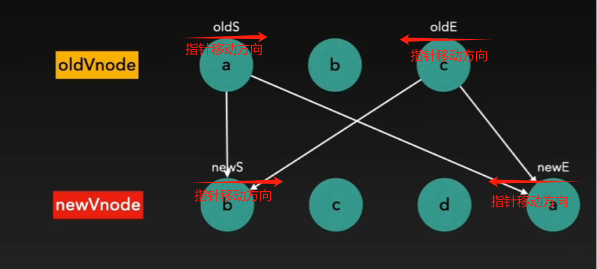

# Diff算法分析

Diff算法用于计算两个序列之间的最小差异，广泛应用于文本比较、代码版本控制等场景。

Vue中的`updateChildren`需要实际结合 Diff算法 来快速找出两个虚拟DOM之间变化的子节点，并高效地更新真实DOM。

下面提供两个数组，分别代表同级新旧虚拟DOM节点，看Diff算法的几种演变形式如何去处理：
```js
// old vdom
const oldVdomNodes = [
  { type: "p", children: "p1", key: 1 },
  { type: "div", children: "div", key: 2 },
  { type: "span", children: "span", key: 3 },
  { type: "input", children: "input", key: 4 },
  { type: "a", children: "a", key: 6 },
  { type: "p", children: "p2", key: 5 }
]

// new vdom
const newVdomVodes = [
  { type: "p", children: "p1", key: 1 },
  { type: "span", children: "span", key: 3 },
  { type: "div", children: "div", key: 2 },
  { type: "input", children: "input", key: 4 },
  { type: "p", children: "p2", key: 5 },
  { type: "h4", children: "h4", key: 7 }
]
```

## 普通Diff

普通的Diff算法就是遍历两个数组，逐个去比较两者的区别：
```js

function improvedNormalDiff(oldVNodes, newVNodes) {
  const resultVnodes = []

  // 遍历newVNodes，按照newVNodes的顺序构建最终结果
  newVNodes.forEach(newNode => {
    let exists = false

    // 查找oldVNodes中是否有相同key的节点
    for (let i = 0; i < oldVNodes.length; i++) {
      if (oldVNodes[i] !== null && oldVNodes[i].key === newNode.key) {
        exists = true
        console.log(`节点 key=${newNode.key} 存在，复用旧节点。`)
        // 合并新旧节点，通常是以新节点为主
        resultVnodes.push({ ...oldVNodes[i], ...newNode }) 
        // 标记为已处理（即不再参与后续匹配）
        oldVNodes[i] = null 
        break
      }
    }

    // 添加newVnode新增的节点（oldVnodes没有的节点）
    if (!exists) {
      console.log(`节点 key=${newNode.key} 是新增节点。`)
      resultVnodes.push(newNode)
    }
  })

  // 删除oldVnodes多余节点（newVnodes没有的节点）
  oldVNodes.forEach(oldNode => {
    if (oldNode !== null) {
      console.log(`节点 key=${oldNode.key} 将被删除。`)
    }
  })

  return resultVnodes
}
```

可以看出，普通Diff算法的时间复杂度是`O(n*m)`，其中`n`和`m`分别代表两个比较数组的长度。

:::warning 普通Diff算法带来的问题：
其工作原理是通过 **逐个节点比较** 两个虚拟DOM的节点，对于每个新节点，它都需要遍历整个旧虚拟DOM，查找是否存在相同的节点。即使新旧节点的顺序非常相似，算法依然会进行完全的比较，这种方式没有必要且非常损耗性能。
:::


## 双端Diff

双端Diff也就是首尾指针对比法，Vue就是采用这种算法结合**同级对比**来比较新旧虚拟节点，并确定如何高效地更新DOM。算法的具体思路如下：

使用4个指针（`oldStart`、`oldEnd`、`newStart`、`newEnd`）同时从头尾向中间比较，每次比较完毕向中间靠拢，当新虚拟Dom或旧虚拟Dom的头尾指针相遇时，即比较完成，算法结束。



### 首尾对比

1. 旧头`oldStart` vs 新头`newStart` (匹配成功：`oldStart++`、`newStart++`)
2. 旧尾`oldEnd` vs 新尾`newEnd` (匹配成功：`oldEnd--`、`newEnd--`)
3. 旧头`oldStart` vs 新尾`newEnd` (匹配成功：`oldStart++`、`newEnd--`)
4. 旧尾`oldEnd` vs 新头`newStart` (匹配成功：`oldEnd--`、`newStart++`)

匹配成功**以`newVnodes`的位置为准**，直接复用到真实Dom，并使指针往中间靠拢。

### 首尾对比失败

如果以上4种情况都不匹配，Vue进入更复杂的处理逻辑：

1. 在`oldVNodes`中查找`newStart`对应的`key`：   
  > 找到了，移动到`newStart`位置。    
  > 没找到，说明是新节点，直接插入。

2. 对比完毕：`oldStart > oldEnd || newStart > newEnd`：   
  > 删除多余的旧节点。   
  > 插入多余的新节点。

```js
function improvedDoubleEndedDiff(oldVNodes, newVNodes) {
  const resultVnodes = []
  let oldStart = 0,
    oldEnd = oldVNodes.length - 1,
    newStart = 0,
    newEnd = newVNodes.length - 1

  // 1. 头尾指针进行比对
  while (oldStart <= oldEnd && newStart <= newEnd) {
    if (oldVNodes[oldStart] && oldVNodes[oldStart].key === newVNodes[newStart].key) {
      // 旧头 vs 新头：相同，复用，移动指针
      resultVnodes.push(newVNodes[newStart])
      oldStart++
      newStart++
    } else if (oldVNodes[oldEnd] && oldVNodes[oldEnd].key === newVNodes[newEnd].key) {
      // 旧尾 vs 新尾：相同，复用，移动指针
      resultVnodes.push(newVNodes[newEnd])
      oldEnd--
      newEnd--
    } else if (oldVNodes[oldStart] && oldVNodes[oldStart].key === newVNodes[newEnd].key) {
      // 旧头 vs 新尾：相同，复用，移动指针
      resultVnodes.push(newVNodes[newEnd])
      oldStart++
      newEnd--
    } else if (oldVNodes[oldEnd] && oldVNodes[oldEnd].key === newVNodes[newStart].key) {
      // 旧尾 vs 新头：相同，复用，移动指针
      resultVnodes.push(newVNodes[newStart])
      oldEnd--
      newStart++
    } else {
      // 复杂情况（节点顺序不同，需要查找是否存在复用节点）
      let found = false
      for (let i = oldStart; i <= oldEnd; i++) {
        if (oldVNodes[i] && oldVNodes[i].key === newVNodes[newStart].key) {
          // 根据newStart 在 旧VNode 中找匹配项，将其移动
          resultVnodes.push(newVNodes[newStart])
          oldVNodes[i] = null // 标记为已处理
          found = true
          break
        }
      }
      if (!found) {
        // 旧VNode 中没有找到匹配项，说明是新节点，直接插入
        resultVnodes.push(newVNodes[newStart])
      }
      // 更新 newStart
      newStart++
    }
  }

  // 2. 处理多余的新节点（直接插入）
  while (newStart <= newEnd) {
    resultVnodes.push(newVNodes[newStart])
    newStart++
  }

  // 3. 处理多余的旧节点（需要删除）
  while (oldStart <= oldEnd) {
    if (oldVNodes[oldStart] !== null) {
      console.log(`节点 key=${oldVNodes[oldStart].key} 将被删除。`)
    }
    oldStart++
  }

  return resultVnodes
}
```

### 推演

假设有以下数据：
```js
// 旧 VDOM
const oldVNodes = [
  { key: 1, tag: "div" },
  { key: 2, tag: "p" },
  { key: 5, tag: "input" }
]

// 新 VDOM
const newVNodes = [
  { key: 1, tag: "div" },
  { key: 3, tag: "span" },
  { key: 4, tag: "h4" },
  { key: 5, tag: "input" },
  { key: 2, tag: "p" }
]
```
**第一步：首尾比较**
- **旧头 vs 新头**
```js
oldStart[0].key/*1*/ === newVNodes[0].key/*1*/
```
匹配成功，复用`newVNodes[0]`，更新`oldStart++`、`newStart++`
> 此时：oldStart = 1、newStart = 1、    
> resultVNodes = [{ key: 1, tag: "div" }]   

继续匹配：
```js
oldStart[1].key/*2*/ !== newStart[1].key/*3*/
```
匹配失败，跳过

---

- **旧尾 vs 新尾**
```js
oldEnd[2].key/*5*/ !== newEnd[4].key/*2*/
```   
匹配失败，跳过

---

- **旧头 vs 新尾**
```js
oldStart[1].key/*2*/ === newEnd[4].key/*2*/
```
匹配成功，复用`newEnd[4]`，更新`oldStart++`、`newEnd--`
> 此时：oldStart = 2、newStart = 1、oldEnd = 2、newEnd = 3、    
> resultVNodes = [{ key: 1, tag: "div" }, { key: 2, tag: "p" }]   

继续匹配：
```js
oldStart.key[2]/*5*/ !== newStart[1].key/*2*/
```
匹配失败，跳过

继续匹配：
```js
oldEnd.key[2]/*5*/ === newEnd[3].key/*5*/
```  
匹配成功，复用`newEnd[3]`，更新`oldEnd--`、`newEnd--`
> 此时：oldStart = 2、newStart = 1、oldEnd = 1、newEnd = 2、    
> resultVNodes = [{ key: 1, tag: "div" }, { key: 2, tag: "p" }, { key: 5, tag: "input" }]   

此时，`oldStart > oldEnd`条件满足，`while`循环终止

---

- 新头 vs 旧尾

`while`已结束，未触及。

---

**第二步：中间查找**

`while`已结束，未触及。

---

**第三步：多余处理**

此时`newStart = 1、newEnd = 2`，进入`while (newStart <= newEnd)`，将多余的两个节点（`span`、`h4`）添加进去`resultVNodes`，此时整个算法已执行完毕：
> resultVNodes = [{ key: 1, tag: "div" }, { key: 2, tag: "p" }, { key: 5, tag: "input" }, { key: 3, tag: "span" }, { key: 4, tag: "h4" }]

:::tip
双端Diff算法的时间复杂度，最坏的情况下依然是`O(n*m)`，例如头尾总不匹配，中间元素频繁调整位置，需要反复遍历两个数组访问。最好的情况下则接近`O(n)`，也就是每个元素仅需要访问一次。
:::


## LIS Diff

尽管双端Diff算法已经对普通Diff算法做了不少优化，减少了不必要的遍历。

但其仍然有优化空间，例如当节点顺序发生大范围改变时，它仍然需要在中间部分进行遍历查找，性能下降。并且没有找出“最少的移动操作”，例如下面这个例子：
```js
const oldVNodes = [
  { key: 1, tag: "div" },
  { key: 2, tag: "p" },
  { key: 3, tag: "span" },
  { key: 4, tag: "h4" }
]

const newVNodes = [
  { key: 2, tag: "p" },
  { key: 3, tag: "span" },
  { key: 1, tag: "div" },
  { key: 4, tag: "h4" }
]
```
最优方案应该是：发现`[2, 3, 4]` 位置不变，只需要移动`key=1`，而 双端Diff 可能会产生多次移动，实际移动成本更高。

---

**最长递增子序列（LIS）**
- 先找出 不需要移动的最长递增子序列（这些节点相对位置正确，不需要动）。
- 只移动 非递增序列的节点，保证最少的 DOM 操作。

```js
// 获取 最长递增子序列
function getSequence(arr) {
  const result = [] // 存储 LIS 的索引序列
  const pos = [] // 记录当前索引在 result 中的前驱索引
  const predecessor = new Array(arr.length).fill(-1) // 记录 LIS 中元素的前驱索引

  for (let i = 0; i < arr.length; i++) {
    let num = arr[i]
    if (num === -1) continue // -1 代表该元素在旧 VDOM 中不存在

    // 二分查找 LIS 序列中比当前元素小的最大值位置
    let left = 0,
      right = result.length - 1
    while (left <= right) {
      let mid = Math.floor((left + right) / 2)
      if (arr[result[mid]] < num) left = mid + 1
      else right = mid - 1
    }

    if (left < result.length) {
      result[left] = i // 替换当前位置的元素
    } else {
      result.push(i) // 扩展 LIS 序列
    }
    pos[i] = left > 0 ? result[left - 1] : -1 // 记录前驱索引
  }

  // 回溯找到 LIS 的完整索引
  let lastIndex = result.length - 1
  for (let i = result[result.length - 1]; i >= 0; i = pos[i]) {
    result[lastIndex--] = i
  }

  return result
}

function improvedLISDiff(oldVNodes, newVNodes) {
  let oldStart = 0,
    oldEnd = oldVNodes.length - 1
  let newStart = 0,
    newEnd = newVNodes.length - 1
  const resultVnodes = [] // 用于存储最终结果，保持新 VNodes 的顺序

  // 1. 头尾指针优化匹配
  while (oldStart <= oldEnd && newStart <= newEnd) {
    if (oldVNodes[oldStart] && oldVNodes[oldStart].key === newVNodes[newStart].key) {
      resultVnodes.push(newVNodes[newStart]) // 新头 vs 旧头匹配，复用
      oldStart++
      newStart++
    } else if (oldVNodes[oldEnd] && oldVNodes[oldEnd].key === newVNodes[newEnd].key) {
      resultVnodes.push(newVNodes[newEnd]) // 新尾 vs 旧尾匹配，复用
      oldEnd--
      newEnd--
    } else if (oldVNodes[oldStart] && oldVNodes[oldStart].key === newVNodes[newEnd].key) {
      resultVnodes.push(newVNodes[newEnd]) // 新尾 vs 旧头匹配，复用
      oldStart++
      newEnd--
    } else if (oldVNodes[oldEnd] && oldVNodes[oldEnd].key === newVNodes[newStart].key) {
      resultVnodes.push(newVNodes[newStart]) // 新头 vs 旧尾匹配，复用
      oldEnd--
      newStart++
    } else {
      break
    }
  }

  // 2. 建立旧 VDOM 的索引映射
  const oldKeys = new Map()
  for (let i = oldStart; i <= oldEnd; i++) {
    oldKeys.set(oldVNodes[i].key, i)
  }

  // 3. 生成新 VDOM 中的索引数组
  const newIndices = []
  for (let i = newStart; i <= newEnd; i++) {
    if (oldKeys.has(newVNodes[i].key)) {
      newIndices.push(oldKeys.get(newVNodes[i].key)) // 新节点在旧 VDOM 中有匹配项
    } else {
      newIndices.push(-1) // -1 代表新节点
    }
  }

  // 4. 寻找 LIS，标记出不需要移动的节点
  const lis = getSequence(newIndices) // 计算 LIS
  let lisIndex = lis.length - 1

  // 5. 反向遍历新 VDOM 进行插入、移动优化
  for (let i = newIndices.length - 1; i >= 0; i--) {
    const newVNode = newVNodes[newStart + i]
    if (newIndices[i] === -1) {
      // 插入新节点
      console.log(`插入新节点 key=${newVNode.key}`)
      resultVnodes.push(newVNode)
    } else if (lisIndex < 0 || newIndices[i] !== lis[lisIndex]) {
      // 移动节点（只在 LIS 中不匹配时）
      console.log(`移动节点 key=${newVNode.key}`)
      resultVnodes.push(newVNode)
    } else {
      // LIS 匹配，跳过
      lisIndex--
    }
  }

  // 6. 处理删除的旧节点
  while (oldStart <= oldEnd) {
    console.log(`删除旧节点 key=${oldVNodes[oldStart].key}`)
    oldStart++
  }

  return resultVnodes
}
```

:::tip
LIS Diff算法的时间复杂度为`O(n log n)`。
:::

<!-- <RecoDemo :collapse="true">
  <template slot="code-NormalDiff">
    <<< @/docs/reco/NormalDiff.js
  </template>
  <template slot="code-DoubleEndedDiff">
    <<< @/docs/reco/DoubleEndedDiff.js
  </template>
  <template slot="code-LISDiff">
    <<< @/docs/reco/LISDiff.js
  </template>
</RecoDemo> -->

<Vssue />