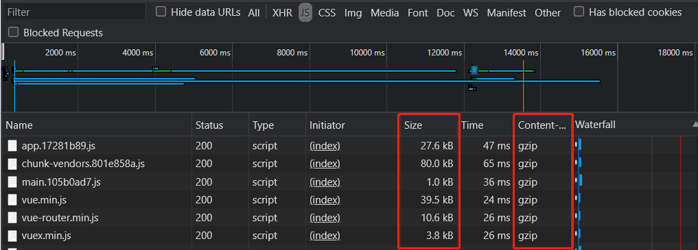

# 打包优化汇总

## CDN加速
1. 将一些不需要改动的框架/库在`index.html`通过CDN的方式引入。
```html
<!-- index.html -->
<head>
  <link rel="stylesheet" href="https://cdn.bootcss.com/element-ui/2.11.1/theme-chalk/index.css">
</head>

<body>
  <div id="app"></div>
  <script src="https://cdn.bootcss.com/vue/2.5.2/vue.min.js"></script>
  <script src="https://cdn.bootcss.com/vue-router/3.0.1/vue-router.min.js"></script>
  <script src="https://cdn.bootcss.com/axios/0.19.0/axios.min.js"></script>
  <script src="https://cdn.bootcss.com/element-ui/2.11.1/index.js"></script>
</body>
```
2. 配置`externals`字段，告诉**webpack**这些库不参与打包，`key`是包名，`value`是依赖包暴露出来的**全局变量**。

 * **vue-cli2.x**版本，在`webpck.base.conf.js`中配置：
 ```js
 // webpck.base.conf.js
externals: {
  "vue": "Vue",
  "vue-router": "VueRouter",
  "vuex": "Vuex",
  "axios": "axios",
  "element-ui": "ELEMENT"
},
 ```

 * **vue-cli3.x**版本，在`vue.config.js`中配置：
 ```js
 // vue.config.js
module.exports = {
  chainWebpack: config => {
    config.externals({
      "vue": "Vue",
      "vue-router": "VueRouter",
      "vuex": "Vuex",
      "element-ui": "ELEMENT",
      "view-design": "iview",
      "iview": "ViewUI"
    })
}
 ```
:::warning
* 在`main.js`中，相应的框架/库，例如**vue**、**element-ui**都不需要`import`引入了。如果项目中使用了**eslint**校验，可以在文件首行写上`/* eslint-disable */`禁止校验当前文件。\
若是报`xxx is not a defined`等等类似错误，那是因为使用的是CDN资源，抛出的**全局变量**与在项目中使用的**全局变量**对不上，只需要改过即可。
```js
Vue.use(Router) //替换为Vue.use(VueRouter) 

export default new Router({ ... }) //替换为new VueRouter
```

* 通过CDN引入的资源版本必须跟开发环境版本一致，否则可能会引发兼容性问题，在`package.json`可以查看资源版本。
:::

## 路由懒加载
默认**webpack**会将所有js代码打包为一个整体.如果需要分模块打包，将想要组合在一起的组件打包到一个`chunk`中。

分模块打包需要下面这样使用**webpack**的`require.ensure`，并且在最后加入一个`chunk`名，相同的`chunk`模块才会打包到一起。
```js
const Home = r => require.ensure([], () => r(require("@/components/Home/Home")), "Home")
const Diary = r => require.ensure([], () => r(require("@/components/Diary/Diary")), "Diary")
const Archives = r => require.ensure([], () => r(require("@/components/Archives/Archives")), "Archives")
const About = r => require.ensure([], () => r(require("@/components/About/About")), "About")

export default new Router({
  routes: [
    { path: "/home", name: "home", component: Home },
    { path: "/diary", name: "diary", component: Diary }
    //...
  ]
})
```
上面的方式会将路由打包成4个js文件，需要用到的路由才会加载，从而达到路由懒加载，减小了js的文件体积。

## 关闭生成.map文件
**webpack**默认会生成**map**文件，**map**文件是用来调试代码的。生产环境不需要用到这些文件。

**vue-cli2.x**，打开`config/index.js`，写上下面配置。
```js
productionSourceMap: false,
```
**vue-cli3.x**，打开`vue.config.js`，在导出的对象中，写上下面配置。
```js
productionSourceMap: false,
```

## 关闭debug和console
在生产版本移除一些console的提示信息。

打开`webpack.prod.conf.js`添加`drop_debugger`和`drop_console`。
```js
new UglifyJsPlugin({
  uglifyOptions: {
    compress: {
      warnings: false,
      // 以下两行配置，关闭 debug 和 console
      drop_debugger:true,
      drop_console:true
    }
  },
  sourceMap: config.build.productionSourceMap,
  parallel: true
}),
```

## Chunk文件合并
**webpack**默认会打包生成很多`chunk`块文件，有时多达几百个`chunk`文件，虽然这些文件零零碎碎体积并不是很大，但是浏览器http并发请求文件最大数一般不超过10个，这样一来，这么多的`chunk`文件就会造成加载性能的问题。

最好的解决办法就是将这些`chunk`文件打包合并起来：
```js
// vue.config.js
const webpack = require("webpack")

module.exports = {
  configureWebpack: {
    plugins: [
      new webpack.optimize.LimitChunkCountPlugin({
        maxChunks: 5,
        minChunkSize: 100
      })
    ]
  }
}
```

## Gzip压缩文件

利用服务器打包压缩请求的代码，能大幅度减小请求的代码体积，需要后端配合。

### Vue配置gzip压缩

安装`compression-webpack-plugin`插件，安装该固定版本的即可，该插件高版本可能会报错。
```sh
npm install compression-webpack-plugin@5.0.1 -S
```
* **vue-cli2.x版本配置**
```js
// config/index.js
productionGzip: true, //把false改为true
    
// build/webpack.prod.conf.js
new HtmlWebpackPlugin({
  filename: config.build.index, //此处将assets修改为filename
  template: "index.html",
  inject: true,
  minify: {
    removeComments: true,
    collapseWhitespace: true,
    removeAttributeQuotes: true
    // more options:
    // https://github.com/kangax/html-minifier#options-quick-reference
  },
  // necessary to consistently work with multiple chunks via CommonsChunkPlugin
  chunksSortMode: "dependency"
}),
```
* **vue-cli3.x版本配置**
```js
const CompressionPlugin = require("compression-webpack-plugin")
const productionGzipExtensions = ["js", "css", "html", "jpg", "jpeg", "png"]

module.exports = {
  configureWebpack: {
    plugins: [
      new CompressionPlugin({
        algorithm: "gzip",
        test: new RegExp("\\.(" + productionGzipExtensions.join("|") + ")$"),
        threshold: 10240,
        minRatio: 0.8
      })
    ]
  }
}
```
配置完，再重新打包编译就可以了。
```shell
  File                                    Size             Gzipped

  dist\js\chunk-769ca5b4.a96766d3.js      2508.38 KiB      645.57 KiB
  dist\js\chunk-102df11c.4e8eb7f1.js      613.85 KiB       144.32 KiB
  dist\js\chunk-vendors.801e858a.js       231.32 KiB       78.39 KiB
  dist\js\app.17281b89.js                 117.66 KiB       26.81 KiB
  dist\js\main.105b0ad7.js                1.54 KiB         0.74 KiB
  
  dist\theme\dark\index.css               489.03 KiB       57.99 KiB
  dist\theme\light\index.css              488.00 KiB       57.49 KiB
  dist\css\chunk-769ca5b4.21b4e2b5.css    308.13 KiB       20.55 KiB
  dist\css\app.4475f03e.css               35.16 KiB        4.80 KiB
  dist\css\chunk-vendors.582dcb44.css     7.98 KiB         2.99 KiB
  
```
打包后的文件大小在`Size`下面列了出来，而右侧`Gzipped`一列则表示经过gzip压缩后的文件大小。

仅前端对文件配置压缩还不行，文件最终都要放到服务器上，服务器也要配置gzip压缩。

### Apache配置gzip压缩

打开`httpd.conf`文件，找到以下两条注释，并打开它们：
```ruby
LoadModule deflate_module modules/mod_deflate.so
LoadModule headers_module modules/mod_headers.so
```
在`httpd.conf`文件的最后，添加如下代码：

```ruby
<IfModule mod_deflate.c>
  # 告诉 apache 对传输到浏览器的内容进行压缩
  SetOutputFilter DEFLATE
  # 压缩等级 9
  DeflateCompressionLevel 9
  # 不对后缀gif，jpg，jpeg，png的图片文件进行压缩
  SetEnvIfNoCase Request_URI .(?:gif|jpe?g|png)$ no-gzip dont-vary
</IfModule>
```
最后重启Apache服务器。

### Nginx配置gzip压缩

打开`nginx.conf`文件，将`gzip`字段打开，设置值为`on`，并填入如下配置：
 ```ruby
 gzip              on;
 gzip_min_length   1k;
 gzip_buffers      4 16k;
 gzip_http_version 1.1;
 gzip_comp_level   9;
 gzip_types        text/plain application/x-javascript text/css application/xml application/json application/javascript text/javascript application/x-httpd-php image/jpeg image/gif image/png;
 gzip_vary         on;
 gzip_disable      "MSIE [1-6]\.";
 ```
回到nginx目录，重启nginx服务器
```sh
./sbin/nginx -s reload
```
重启服务器后浏览网站，看到请求的资源文件确实变小了，而且也都经过了`Gzip`压缩。



## 首屏Loading动画
若是使用了所有以上的方案之后，加载速度还是没能达到预期，此时除了从**代码层面优化**或者**提升服务器配置带宽**等等之外。还可以使用首屏Loading动画，此项并非真正意义上的优化加载速度，而是在对应的资源文件还未加载完毕之前，制造一个`loading`动画来优化用户体验。
```html
<!-- index.html -->
<style type="text/css">
  #Loading {
    position: absolute;
    top: 50%;
    left: 50%;
    z-index: 100;
    font-size: 50px;
    font-weight: bold;
    text-align: center;
    color: #333;
    -webkit-transform: translateY(-50%) translateX(-50%);
    transform: translateY(-50%) translateX(-50%);
  }

  .ball-beat>div {
    display: inline-block;
    width: 20px;
    height: 20px;
    margin: 4px;
    border-radius: 50%;
    background-color: #279fcf;
    -webkit-animation: ball-beat 0.7s 0s infinite linear;
    animation: ball-beat 0.7s 0s infinite linear;
    -webkit-animation-fill-mode: both;
    animation-fill-mode: both;
  }

  .ball-beat>div:nth-child(2n-1) {
    -webkit-animation-delay: 0.35s !important;
    animation-delay: 0.35s !important;
  }

  @-webkit-keyframes ball-beat {
    50% {
      opacity: 0.2;
      -webkit-transform: scale(0.75);
      transform: scale(0.75);
    }
    100% {
      opacity: 1;
      -webkit-transform: scale(1);
      transform: scale(1);
    }
  }

  @keyframes ball-beat {
    50% {
      opacity: 0.2;
      -webkit-transform: scale(0.75);
      transform: scale(0.75);
    }
    100% {
      opacity: 1;
      -webkit-transform: scale(1);
      transform: scale(1);
    }
  }
</style>

<body>
  <div id="Loading">
    Loading
    <div class="loader-inner ball-beat">
      <div></div>
      <div></div>
      <div></div>
    </div>
  </div>
  <div id="app"></div>
</body>
```
当资源加载完毕，进入程序的时候，在`app.vue`的`created`生命周期内，获取loading的Dom元素，将该元素销毁，从而关闭动画。
```js
// App.vue
export default {
  created() {
    const loading = document.querySelector("#Loading")
    document.body.removeChild(loading)
  }
}
```

<Vssue />