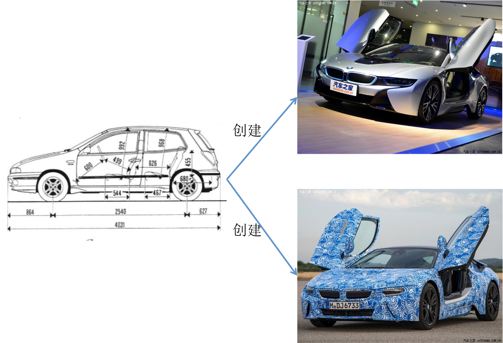

# 类

## 面向对象 & 面向过程
* **面向过程** 强调的是功能行为，关注的是解决问题需要哪些步骤，并用代码一步步去实现。
* **面向对象** 强调的是具有功能行为的对象，关注的是解决问题需要哪些对象，并把这些对象创建出来，添加对应的属性和行为，让这些对象去实现。

## 类
可以这么理解：类是创建对象的一种模板。\
在实际开发中，使用面向对象的模式来开发，遇到许多的对象具有相同的特征，我们就应该设计一个模板，这个模板具有这些对象共有的特征，并且让这个模板来为我们创建对象



#### 通过系统的Object构造函数创建对象
```js
var obj = new Object()
```
#### 通过对象字面量创建对象
```js
var obj = {}
```

#### 通过工厂方法创建对象
```js
function createObject(name) {
  var obj = new Object()
  obj.name = name
  return obj
}
var obj = createObject('Hello')
```

### 设计类
虽然JavaScript不是面向对象的语言，但是它的函数中有一个属性`prototype`，该属性指向一个对象，并且对象所处的内存空间是共享的。当函数作为构造函数时，`prototype`就起到类似`class`的作用。

#### 使用构造函数来设计一个类
在JS中，一个`function`关键字声明的函数就是一个类了（按照规范，构造函数须以大写字母开头）
```js
function Person(){ }
```
#### 构造函数产生对象
每当使用`new`关键字来调用这个函数时，浏览器会将这个函数的返回值来生成一个全新的对象，这个对象就是实例对象
```js
function Person(){ }
var per = new Person() //实例对象
```

#### 函数中的this关键字
使用`new`关键字调用一个构造函数时，浏览器不仅处理了返回值，还将构造函数内部的`this`指向新创建的实例对象，因此可以在内部用`this`指定各种属性，通过传递不同的参数来创建不同的实例对象
```js
function Person(name, age) {
  this.name = name
  this.age = age
  this.sayHello = function(){
    alert(this.name)
  }
}

var xh = new Person('小红', 18)
var xq = new Person('小强', 19)

xh.sayHello() //'小红'
xq.sayHello() //'小强'
```
这样就已经创建了一个简单的类了。

但是通过这样的类来创建对象有明显的缺陷：内存被过多占用。每当通过`new`关键字调用构造函数，就会在内存中开辟一块空间，来保存这个新对象的属性和方法。

对于需要动态变化的属性或方法，应该保持每份都独立占有内存。\
但是某些属性和方法是不变的，就不应该占有一份独立内存\
为了解决这个问题，我们设计一个类的时候，通常会把对象共有的属性方法放到一个公共的内存地址。就是`prototype`原型对象

#### 利用原型对象共享数据
```js
function Person(name,age) {
  this.name = name;
  this.age = age;
}

Person.prototype = {
  constructor: Person,
  sayHello: function () {
    alert(this.name)
  }
}

var xh = new Person('小红', 18)
var xq = new Person('小强', 19)

xh.sayHello() //'小红'
xq.sayHello() //'小强'
```

### 封装
隐藏实现细节，对外仅公开接口。\
当一个类把自己的成员变量暴露给外部，那么别人就可以随意修改设置这个类的成员变量。而封装就是将数据隐藏起来，只有调用该类的方法才能读取或设置数据，这样就降低了数据被误用的可能性

`静态属性`、`静态方法`、`实例属性`、`实例方法`

写在类内部的属性和方法，称作静态方法，仅类能调用\
写在原型对象之内的属性和方法，称作实例方法，类和类产生的对象都能调用\
写在类内部通过`this`指定的属性或者方法，也是实例方法，因为`this`是动态指向实例的
```js
function Person(name) {
  this.name = name;       //实例属性(公有)
  var age = 888;          //静态属性(私有)
  var eat = function () { //静态方法
    alert('class method')
  }
}

// 写在原型内部的，全部都是实例属性/方法 (共有)
Person.prototype = {
  constructor: Person,
  gender: 'GG or MM',
  sayHello: function () {
    alert(this.name)
  },
  play: function () {
    this.sayHello()
  }
}

var xh = new Person('小红')

xh.name; //小红  公有属性可访问
xh.type; //undefined 私有属性不可访问
Person.type; //class 仅有类自己能够访问


// 实例的属性和方法都能访问
xh.gender; //GG or MM
xh.play(); //小红
```

把构造函数产生实例对象的方法封装到原型中：
```js
function Person(param, age) {
  this.age = age;
  // 将 产生实例对象 的功能封装到原型方法内
  return new Person.prototype.init(param)
}

Person.prototype = {
  constructor: Person,
  key: 'value',
  init: function (param) {
    this.name = param
  }
}

// 修改原型方法的原型指向为构造函数的原型，否则实例无法调用构造函数的原型
Person.prototype.init.prototype = Person.prototype;

var xh = new Person('小红', 18) // { name: '小红' }

console.log(xh.constructor); // Person(){ }

xh.__proto__ === Person.prototype.init.prototype      //true
xh.__proto__ === Person.prototype                     //true
Person.prototype.init.prototype === Person.prototype  //true

console.log(xh.age); // undefined 封装了 由原型方法产生实例对象，故而类内部的属性实例无法访问
console.log(xh.key); // value 但是原型内的属性可以正常访问
```

<Vssue />