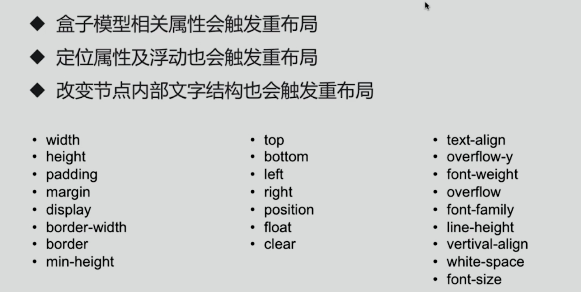
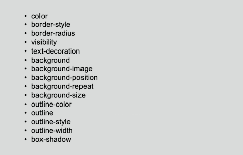

# 浏览器渲染机制

## 渲染引擎
在浏览器中有以下几种常驻线程：

* GUI渲染线程：负责渲染页面中的元素
* JS引擎线程：负责解析并执行JS代码
* 定时触发器线程：负责定时器的计时
* 事件触发线程：负责管理任务队列
* 异步http请求线程：负责异步http请求

### 渲染引擎的工作流程
1. `DOM Tree`：解析HTML生成DOM树
2. `CSS Rule Tree`：解析CSS生成CSS规则树
3. `Render Tree`：将DOM和CSSOM合并生成渲染树
4. `Layout`：遍历渲染树开始布局，计算每个位置节点大小信息
5. `Painting`：将渲染树的每个节点绘制到屏幕

## 构建DOM树
当浏览器接收到服务器响应来的html文档后，会遍历文档节点，生成DOM树

## 构建CSSOM规则树
浏览器解析CSS文件并生成CSS规则树，每个CSS文件都被分析成一个StyleSheet对象，每个对象都包含CSS规则。

CSS规则对象包含对应于CSS语法的选择器和声明对象以及其他对象

## 渲染阻塞
当浏览器遇到一个`script`标记时，DOM构建将暂停，直至脚本完成执行，然后继续构建DOM。

每次去执行JavaScript脚本都会严重地阻塞DOM树的构建，如果JavaScript脚本还操作了CSSOM，而正好这个CSSOM还没有下载和构建，浏览器甚至会延迟脚本执行和构建DOM，直至完成其CSSOM的下载和构建。

所以，`script`标签的位置很重要。实际使用时，可以遵循下面两个原则：

* CSS优先：引入顺序上，CSS资源先于JavaScript资源。
* JS置后：我们通常把JS代码放到页面底部，且JavaScript应尽量少影响DOM的构建。

## 构建渲染树
通过DOM树和CSS规则树便可以构建渲染树。

浏览器会先从DOM树的根节点开始遍历每个可见节点。然后对每个可见节点，找到其适配的CSS样式规则并应用

:::tip
渲染树用于显示，所谓可见节点，是会显示在页面的元素节点。例如`head`无样式元素，`display:none`不可见元素不占空间等等...之类都不会出现在渲染树之中。\
但是这些节点还是会出现在DOM树之中，DOM跟随整个html文档的节点来构建，包括文本节点也会被构建
:::

## 渲染树布局
布局阶段会从渲染树的根节点开始遍历，然后确定每个节点对象在页面上的确切大小与位置。

布局阶段的输出是一个盒子模型，它会精确地捕获每个元素在屏幕内的确切位置与大小。

## 渲染树绘制
在绘制阶段，遍历渲染树，调用渲染器的paint方法在屏幕上显示其内容

## 回流/重排（Reflow）
Reflow意味着元素的`位置`或`大小`改变了，需要重新验证并计算渲染树。根据改变的范围和程度，渲染树中或大或小的部分需要重新计算。

有些改变会触发整个页面的Reflow，比如，滚动条出现的时候或者修改了根节点。

触发Reflow的css属性有这些：



:::tip
每个页面至少都会发生一次`Refolw`，也就是在第一次加载页面的时候，构建渲染树，计算位置大小信息
:::

## 重绘（Repaint）
屏幕的一部分重画，不影响整体布局，比如某个CSS的背景色变了，但元素的`位置`、`大小`不变

触发Repaint的css属性有这些：



根据渲染引擎的工作流程，可以得出`Reflow`一定会引发`Repaint`，而`Repaint`不一定会引发`Reflow`。

为了提升页面的性能，减少渲染次数，无论是`Reflow`或者`Repaint`，我们都应当尽量避免

## 队列化

由于每次`Reflow`都会造成额外的计算消耗，因此大多数浏览器都会通过队列化修改并批量执行来优化`Reflow`过程，浏览器会将修改操作置入到队列里，直到过了一段时间或者操作达到了一个阈值，才清空队列
```js
const el = document.getElementById("test")
el.style.padding = '5px';
el.style.borderLeft = '1px';
el.style.borderRight = '2px';
```
以上代码，有三个样式的属性被修改了，每一个都会影响元素的几何结构，引起`Reflow`。

在现代浏览器中，浏览器会将这些引发`Reflow`、`Repaint`的操作放到一个队列中，并批量执行。所以说，以上操作在高版本浏览器实际上只执行了一次`Reflow`

### 强制刷新
但是，当获取布局信息的操作的时候，会强制队列刷新，比如访问以下属性或者使用以下方法：

* offsetTop、offsetLeft、offsetWidth、offsetHeight
* scrollTop、scrollLeft、scrollWidth、scrollHeight
* clientTop、clientLeft、clientWidth、clientHeight
* getComputedStyle()
* getBoundingClientRect

以上属性和方法都需要返回最新的布局信息，因此浏览器不得不清空队列，触发回流重绘来返回正确的值

因此，我们在修改样式的时候，最好避免使用上面列出的属性，他们都会刷新渲染队列。如果要使用它们，最好将值缓存起来

### 优化方案
简单列举一些优化方案，来尽量避免回流和重绘的次数

* **CSS**
   * 避免使用`table`布局
   * 尽可能在DOM树的最末端改变class
   * 避免设置多层内联样式
   * 将动画效果应用到`position`属性为`absolute`或`fixed`的元素上
   * 避免使用CSS表达式，例如：`calc()`

* **JavaScript**
   * 避免频繁操作样式，最好一次性重写`style`属性，或者将样式列表定义为class并一次性更改class属性
   * 避免频繁操作DOM，创建一个`documentFragment`，在它上面应用所有DOM操作，最后再把它添加到文档中
   * 也可以先为元素设置`display:none`，操作结束后再把它显示出来（在display属性为none的元素上进行的DOM操作不会引发回流和重绘）
   * 避免频繁读取会引发回流/重绘的属性，如果确实需要多次使用，就用一个变量缓存起来
   * 对具有复杂动画的元素使用绝对定位，使它脱离文档流，否则会引起父元素及后续元素频繁回流

<Vssue />
