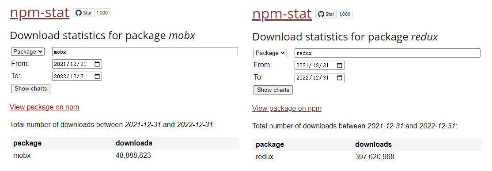

# Mobx-React

Mobx-React 是用于将 Mobx 和 React 集成的工具库。类似于 [React-Redux](/react/react_redux.md)。

## Store

Store 是应用管理数据的地方，Mobx-React 定义的 Store 模型是一个class，并将class实例包装成可观察对象。将来一旦状态对象变更，视图模型就能自动获得更新。

Mobx 按模块将应用状态划分，在多个独立的 Store 中管理。下面代码中定义了一个`counter`的 Mobx Store，并使用`makeAutoObservable`函数将 Store 实例定义为`observable`：
```jsx
// @/store/counter.js
import { observable, action, computed, makeAutoObservable } from "mobx"

class CounterStore {
  @observable count = 0

  constructor() {
    makeAutoObservable(this)
  }

  @computed get getEvenCount() {
    return this.count % 2 === 0 ? this.count : 0
  }

  @action.bound increment = () => {
    this.count++
  }
}

// 导出 Store 给 React 使用
export default CounterStore
```

## Observer

在 React 中，Mobx 的观察者（UI视图模型）通常指的是 React 组件，负责观察`observable`，可以接收到`observable`发生变化时发出的消息，并且根据变化做出响应。`observer`可以用作函数，也可以用作装饰器。

当`observer`用作**函数**时，需要调用函数并传入当前 React 组件。
```jsx
import React from "react"
import { observer } from "mobx-react"

// 类组件
class App extends React.Component {
  render() {
    // ...
  }
}

// 观察 observable 的变化做出响应
export default observer(App)
```
```jsx
import { observer } from "mobx-react"

// 函数组件
export default observer(function App(props) {
  // ...
})
```

当`observer`作为**装饰器**只能用于装饰class组件，效果跟`observer`作为函数是一样的。
```jsx
import React from "react"
import { observer } from "mobx-react"

// 观察 observable 的变化做出响应
@observer
export default class App extends React.Component {
  render() {
    // ...
  }
}
```

## Provider & inject

模块导出的 Store实例 可以保存在一个公共的对象上，该对象通过 Mobx-React 导出的`<Provider />`组件的`store`属性下发给所有后代组件。

```js
// @/store/index.js
import counter from "./counter"

const store = { counter }

export default store
```
```jsx
// @/index.js
import React from "react"
import ReactDOM from "react-dom/client"
import App from "./App"

import { Provider } from "mobx-react"
import store from "./store/index"

const root = ReactDOM.createRoot(document.getElementById("root"))
root.render(
  // store 统一下发给所有后代组件
  <Provider store={store}>
    <App />
  </Provider>
)

export default root
```
后代组件可以通过 inject 注入数据
```jsx
import React from "react"
import { inject, observer } from "mobx-react"

@inject("store") // 注入store
@observer
export default class App extends React.Component {
  render() {
    const { counter } = this.props.store
    const { count, getEvenCount, increment } = counter
    return (
      <div>
        <h2>count：{count}</h2>
        <h2>获取偶数：{getEvenCount}</h2>
        <button onClick={() => increment()}>+1</button>
      </div>
    )
  }
}
```
:::warning
注意修饰符的调用顺序，`observer`要离组件最近的地方声明组件为观察者。
:::

## 封装注入

官方提供的 `inject` 装饰器可以帮助我们注入对应的Store数据。但是装饰器语法只能应用于class组件上，而自从 [React Hooks](/react/hooks.md) 推出之后，函数式组件成为了新的主流风格，为了兼容函数式组件，建议将 Store注入 的功能封装起来。

首先将Store的入口封装成一个class，并初始化每一个子模块到Store的实例上，然后使用 React 的`useContext`将实例暴露出去。
```js
import React from "react"
import CounterStore from "./counter"
import MenuStore from "./menu"

class RootStore {
  constructor() {
    // 初始化子模块
    this.counterStore = new CounterStore()
    this.menuStore = new MenuStore()
  }
}

const rootStore = new RootStore()

const context = React.createContext(rootStore)

export const useStore = () => React.useContext(context)
```

在最外层就不再需要`<Provider>`来下发Store了。而是在每个需要使用Store的组件内导入对应的Store：

```jsx
import { useStore } from "../../store"

export default function CountButton() {
  const { counterStore } = useStore()
  const { increment } = counterStore
  return (
    <div>
      <button onClick={() => increment()}>+1</button>
    </div>
  )
}
```
```jsx
import { observer } from "mobx-react"
import { useStore } from "../../store"

export default observer(function CountText() {
  const { counterStore } = useStore()
  const { count, getEvenCount } = counterStore
  return (
    <div>
      <h2>count：{count}</h2>
      <h2>获取偶数：{getEvenCount}</h2>
    </div>
  )
})
```


## Mobx vs Redux

同样都是状态管理库，无论是 Redux 还是 Mobx，本质都是为了解决状态管理混乱，无法有效同步的问题。两者之间的区别：

* **函数式和面向对象**
   > Redux 更多的是遵循 **函数式编程** 思想，如`reducer`就是一个纯函数，接受输入，然后输出结果，对于相同的输入总是输出相同的结果。除此之外不会有任何影响，也不会影响接收的参数。

   > Mobx 则更多从 **面向对象** 角度考虑问题。通常将状态包装成可观察对象，于是我们就可以使用可观察对象的所有能力，一旦状态对象变更，就能自动获得更新。

---

* **单一Store和多Store**
   > **Store**是应用管理数据的地方，在 Redux 应用中，我们总是将所有共享的应用数据集中在一个大的**Store**中，而 Mobx 则通常按模块将应用状态划分，在多个独立的**Store**中管理。

---

* **JavaScript对象和可观察对象**
   > Redux 默认以JavaScript原生对象形式存储数据，需要手动追踪所有状态对象的变更。而 Mobx 使用可观察对象，当其变更时将自动触发监听。

---

* **不可变和可变**
   > Redux 状态对象通常是不可变的，我们不能直接操作状态对象，而总是在原来状态对象基础上返回一个新的状态对象。而 Mobx 中可以直接使用新值更新状态对象。

---

* **React-Redux 和 Mobx-React**
   > React-Redux 用于连接 Redux 和 React，它提供了`Provider`将Store注入React应用，`connect`负责将Store.state注入容器组件，并选择特定`state`作为容器组件`props`传递。

   > Mobx-React 同样用于连接 Mobx 和 React，它提供了`Provider`将Store注入React应用，`inject`将特定Store注入某组件，Store可以传递`state`或`action`，然后使用`observer`保证组件能响应Store中的可观察对象（observable）变更，即Store更新，组件视图响应式更新。

---

单从 npm 下载量来看的话，在2021一年内，Mobx 的下载量为 5千万次，而 Redux 的下载量将接近4亿次。



:::tip 如何选择
* Mobx 的代码要精简得多，上手也很快，通过 OOP 风格和良好的开发实践，可以快速的构建各种应用。弊端是写法太过自由，容易编写糟糕的不可维护的代码。并且社区发展方面 Mobx 在国内的发展还是比较缓慢的，遇到的问题可能社区都没有遇到过。

* 而 Redux 更受欢迎一些，适合构建大型复杂应用。虽然理解成本较高，上手也较慢，包含各种繁琐的样板代码跟规则，但正是因为这些严格的规定，确保开发人员可以编写易于测试和可维护的代码，对团队规范有比较大的帮助。但是，的确不适合开发小项目。
:::

个人认为，应用数据流不太复杂的情况，推荐使用 Mobx。如果大型项目建议上 Redux。

<Vssue />