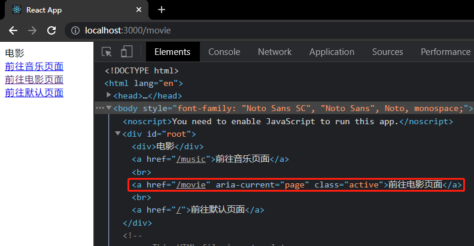

# 路由

:::tip
本章内容基于 `react-router-dom` v5 版本，v6 版本的改变暂未更新。
:::

## React Router

- **`react-router`**：路由核心库，包含诸多和路由功能相关的核心代码。
- **`react-router-dom`**：利用核心库，结合实际的页面，实现跟页面路由相关的功能。

安装使用`react-router-dom`库即可

```sh
npm i react-router-dom -S
```

## 路由的两种模式

### Hash Router

根据 url 地址中的 hash 值来确定显示的组件，hash 值变化不会导致页面刷新，兼容性比较好，老版浏览器也支持。

```js
"https://www.example.com/#/hash"; // '#/hash' 就是hash值
```

### Broswer History Router

HTML5 新增的`History` API，它跟 hash 一样，路径变化不会导致页面刷新，而且它比 hash 更美观，不会在 url 中留下`#`字符。`History`表示浏览器的历史记录，它使用栈的方式存储，当我们每访问一个路径，它会将这个栈中加入一条路径记录。

```js
history.pushState(); //追加历史记录
history.replaceState(); //替换历史记录
window.onpopstate; //监听历史跳转的事件
```

## Router 组件

`react-router-dom`提供了许多的组件来构建路由。`HashRouter`组件和`BrowserRouter`组件就是其中之一，这两个组件会产生一个上下文，上下文会提供一些对象和方法。

- **`HashRouter`**：使用 hash 模式路由。
- **`BrowserRouter`**：使用 history 模式路由。 <Badge text="推荐"/>

这两个组件通常情况下只会使用一次，在应用的最外层使它包裹整个页面。

## Route 组件

Route 组件是路由的出口，它必须存在于 Router 组件之内，它的一系列属性用来配置匹配的规则和展示对应的组件。

### path

匹配浏览器`pathname`的路径，也可以是一个路径正则数组。取值为 `/`，表示应用的默认路径。如果多个`Route`组件的`path`同时匹配，会将所有匹配上的 Route 组件都展示。

### component

路径匹配成功后需显示的组件名。

:::tip
Route 组件可以有多个，Route 组件的位置在哪，对应的 component 组件就渲染在哪。
:::

```jsx
import { BrowserRouter as Router, Route } from "react-router-dom";
// import { HashRouter as Router, Route } from 'react-router-dom'

const Default = () => <div>默认</div>;
const Music = () => <div>音乐</div>;
const Movie = () => <div>电影</div>;

class App extends React.Component {
  render() {
    return (
      <Router>
        {/* 匹配/music路径 */}
        <Route path="/music" component={Music}></Route>
        {/* 匹配/movie路径 */}
        <Route path="/movie" component={Movie}></Route>

        {/* 匹配默认路径 */}
        <Route path="/" component={Default}></Route>
      </Router>
    );
  }
}
```

### exact

开启精确匹配，Route 组件默认是模糊匹配，即浏览器的`pathname`值以 Route 组件的`path`值开头的，就能成功匹配。

下面例子中，Route 组件的`path`值为`/music`，当浏览器`pathname`为`/music`开头时，就会跟该组件匹配成功。

```jsx
class App extends React.Component {
  render() {
    /**
     * 当pathname值为以下几种都会匹配成功：
     * /music        //匹配成功
     * /music/aa     //匹配成功
     * /music/aa/bb  //匹配成功
     */
    console.log(window.location.pathname);
    return (
      <Router>
        <Route path="/music" component={Music}></Route>
      </Router>
    );
  }
}
```

如果要精确匹配，即`pathname`精确为`/music`时，才能匹配该 Route 组件，那么给 Route 组件加上`exact`属性即可。

```jsx {12}
class App extends React.Component {
  render() {
    /**
     * 当pathname值为/music时才会匹配成功：
     * /music        精确匹配成功
     * /music/aa     精确匹配不成功
     * /music/aa/bb  精确匹配不成功
     */
    console.log(window.location.pathname);
    return (
      <Router>
        <Route path="/music" component={Music} exact></Route>
      </Router>
    );
  }
}
```

我们知道，默认路径的`path`值为 `/` ，所以，无论`pathname`值是什么，都会匹配默认 Route 组件，所以默认 Route 组件一般要加上`exact`精确匹配。

```jsx
class App extends React.Component {
  render() {
    return (
      <Router>
        <Route path="/music" component={Music} exact></Route>
        <Route path="/" component={Default} exact></Route>
      </Router>
    );
  }
}
```

### sensitive

是否严格区分大小写，默认是不区分大小写匹配的。

### strict

是否严格匹配 `path` 的最后一个斜杠 `/`，默认不严格匹配最后一个斜杠。

```jsx
class App extends React.Component {
  render() {
    /**
     *  严格匹配path最后一个斜杠 /
     *  /music        匹配不成功
     *  /music/       匹配成功
     *  /music/aa     匹配成功
     *  /music/aa/bb  匹配成功
     */
    console.log(window.location.pathname);
    return (
      <Router>
        <Route path="/music/" component={Music} strict></Route>
      </Router>
    );
  }
}
```

## Switch 组件

多个 Route 组件的`path`同时匹配，会将所有匹配上的 Route 组件都展示。如果给这些 Route 组件加上`Switch`组件包裹，那么只会匹配第一个成功的 Route 组件，不会继续往后匹配。

下面例子中，当`pathname`为`/music`时，会将`Music`组件和`Default`组件都展示，但是加了`Switch`组件，则只会匹配第一个 Route 组件，展示`Music`组件，不会继续往后匹配 Route 组件了。

```jsx
const Default = () => <div>默认</div>;
const Music = () => <div>音乐</div>;
const Movie = () => <div>电影</div>;

class App extends React.Component {
  render() {
    console.log(window.location.pathname);
    return (
      <Router>
        <Switch>
          <Route path="/music" component={Music}></Route>
          <Route path="/movie" component={Movie}></Route>
          <Route path="/" component={Default}></Route>
        </Switch>
      </Router>
    );
  }
}
```

## link 组件

路由入口，相当于 vue 当中的`router-link`，link 组件的`to`属性相当于浏览器中的`pathname`。

link 组件最终会被渲染成页面上的`a`标签，它的`to`属性会被渲染成`a`标签的`href`属性。

```jsx
class App extends React.Component {
  render() {
    return (
      <Router>
        {/* 匹配/music路径 */}
        <Route path="/music" component={Music}></Route>
        {/* 匹配/movie路径 */}
        <Route path="/movie" component={Movie}></Route>

        {/* 匹配默认路径 */}
        <Route path="/" component={Default} exact></Route>

        <Link to="/music">前往音乐页面</Link>
        <br />
        <Link to="/movie">前往电影页面</Link>
      </Router>
    );
  }
}
```

## NavLink 组件

`NavLink`是`Link`组件的一个特定版本，会给匹配上的当前 `NavLink` 元素加上一个`active`的 css 类名。

其他属性：

- **`activeClassName`**：路径匹配成功时的选中 css 类名，默认为`active`。
- **`activeStyle`**：路径匹配成功的内联样式。
- **`exact`**：Boolean，是否精确匹配。
- **`sensitive`**：Boolean，路径匹配是否区分大小写。
- **`strict`**：Boolean，是否严格匹配路径的最后一个斜杠。

```jsx
class App extends React.Component {
  render() {
    console.log(window.location.pathname);
    return (
      <Router>
        <Route path="/" component={Default} exact></Route>
        <Route path="/music" component={Music}></Route>
        <Route path="/movie" component={Movie}></Route>

        <NavLink to="/music">前往音乐页面</NavLink>
        <br />
        <NavLink to="/movie">前往电影页面</NavLink>
        <br />
        <NavLink to="/" exact>
          前往默认页面
        </NavLink>
      </Router>
    );
  }
}
```



## Redirect 组件

重定向组件，当加载到该组件时，会无刷新的跳转页面。类似于 vue 中路由记录的`redirect`字段。

其他属性：

- **`from`**：从什么地址过来。
- **`to`**：重定向到什么地址（也可以是组件对象）。
- **`push`**：重定向时，是否加入历史记录，默认 false (即按 `replace` 的模式重定向)。
- **`exact`**：from 是否精确匹配。
- **`sensitive`**：from 路径匹配是否区分大小写。
- **`strict`**：from 路径是否严格匹配的最后一个斜杠。

```jsx
class App extends React.Component {
  render() {
    console.log(window.location.pathname);
    return (
      <Router>
        <Switch>
          <Route path="/home" component={Home}></Route>
          <Route path="/music" component={Music}></Route>
          <Route path="/movie" component={Movie}></Route>

          {/* 当所有路由都不匹配时，跳回到首页 */}
          <Redirect from="/" to="/home" exact></Redirect>
        </Switch>
      </Router>
    );
  }
}
```

## 嵌套路由

Route 组件作为路由出口，那么在路由出口里面再加一个 Ruote 组件，那么这个组件就成了上个 Route 组件的子组件了，这样一来就形成了嵌套关系。

嵌套路由的`path`格式以父路由的`path`开头，因为只有父组件展示了，子组件才会展示。

```jsx
// /index.js
import Home from "./pages/Home";
import CityList from "./pages/CityList";

class App extends React.Component {
  render() {
    return (
      <Router>
        {/* -----外层路由----- */}
        <Route path="/home" component={Home}></Route>
        <Route path="/cityList" component={CityList}></Route>
      </Router>
    );
  }
}
```

```jsx
// /home/index.js
import { Route } from "react-router-dom";

import News from "../News";

class Home extends React.Component {
  render() {
    return (
      <div>
        首页
        {/* -----嵌套路由，path以父组件path开头----- */}
        <Route path="/home/news" component={News}></Route>
      </div>
    );
  }
}
```

## 编程式导航

编程式导航就是通过 JS 代码控制路由跳转，Vue 中通过`this.$router`实现了编程式导航。

在 React 中也可以使用编程式导航，在组件内，通过`props.history`来跳转路由。

- **`push(path)`**：跳转到目标路径，并把该页面加进历史中（将来可以返回）。
- **`replace(path)`**：跳转到目标路径，不把该页面加进历史中（将来不可以返回）。
- **`goBack()`**：后退一个页面。
- **`goForward()`**：前进一个页面。
- **`go(n)`**：前进或者后退到某个页面，n 表示要前进或者后退的页面数量（正数表示前进，负数表示后退，-1 表示返回到上个页面）。
- **`listen(callback)`**：监听`location`对象，`callback`的参数就是变化后的`location`对象。

:::warning
在 React 中，只有通过路由渲染的组件才拥有`props.history`这个对象，而其他组件是没有的。如果其他组件也想要使用`props.history`这个对象，需要通过内置的高阶组件`withRouter`来赋予。
:::

```jsx
const Music = () => <div>音乐</div>;
const Movie = () => <div>电影</div>;

class Bth extends React.Component {
  handlePush = (path) => {
    this.props.history.push(path);
  };
  render() {
    return (
      <>
        <button onClick={this.handlePush.bind(this, "/music")}>
          前往音乐页面
        </button>
        <button onClick={this.handlePush.bind(this, "/movie")}>
          前往电影页面
        </button>
      </>
    );
  }
}

// 赋予Bth组件 history对象
const NewBth = withRouter(Bth);

class App extends React.Component {
  render() {
    return (
      <Router>
        <Route path="/music" component={Music}></Route>
        <Route path="/movie" component={Movie}></Route>

        <NewBth></NewBth>
      </Router>
    );
  }
}
```

<Vssue />