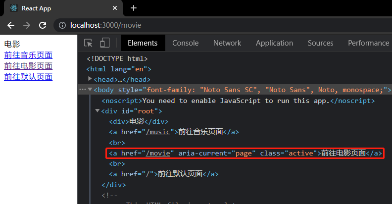

# React-Router-V5

:::tip
本文基于 `react-router-dom` v5 版本，v6 版本的改变请查看 [React-Router-V6](/react/router_v6.html)。
:::

## 路由

- **`react-router`**：路由核心库，包含诸多和路由功能相关的核心代码。
- **`react-router-dom`**：利用核心库，结合实际的页面，实现跟Web页面路由相关的功能。

安装使用`react-router-dom`库即可

```sh
npm i react-router-dom -S
```

## 路由的两种模式

### Hash Router

根据 url 地址中的 hash 值来确定显示的组件，hash 值变化不会导致页面刷新，兼容性比较好，老版浏览器也支持。

```js
"https://www.example.com/#/hash"; // '#/hash' 就是hash值
```

### Broswer History Router

HTML5 新增的`History` API，它跟 hash 一样，路径变化不会导致页面刷新，而且它比 hash 更美观，不会在 url 中留下`#`字符。`History`表示浏览器的历史记录，它使用栈的方式存储，当我们每访问一个路径，它会将这个栈中加入一条路径记录。

```js
history.pushState(); //追加历史记录
history.replaceState(); //替换历史记录
window.onpopstate; //监听历史跳转的事件
```

## Router 组件

`react-router-dom`提供了许多的组件来构建路由。`HashRouter`组件和`BrowserRouter`组件就是其中之一，这两个组件会产生一个上下文，上下文会提供一些对象和方法。

- **`HashRouter`**：使用 hash 模式路由。
- **`BrowserRouter`**：使用 history 模式路由。 <Badge text="推荐"/>

这两个组件通常情况下只会使用一次，在应用的最外层使它包裹整个页面。

```jsx
import React from "react"
import ReactDOM from "react-dom"
import { BrowserRouter as Router } from "react-router-dom"

import App from "./App"

ReactDOM.render(
  <BrowserRouter>
    <App />
  </BrowserRouter>,
  document.getElementById("root")
)
```

## Route 组件

Route 组件是路由的出口，它必须存在于 Router 组件之内，它的一系列属性用来配置匹配的规则和展示对应的组件。

### path

匹配浏览器`pathname`的路径，也可以是一个路径正则数组。取值为 `/`，表示应用的默认路径。如果多个`Route`组件的`path`同时匹配，会将所有匹配上的 Route 组件都展示。

### component

路径匹配成功后需显示的组件名。

:::tip
Route 组件可以有多个，Route 组件的位置在哪，对应的 component 组件就渲染在哪。
:::

```jsx
import { BrowserRouter as Router, Route } from "react-router-dom";
// import { HashRouter as Router, Route } from 'react-router-dom'

const Default = () => <div>默认</div>;
const Music = () => <div>音乐</div>;
const Movie = () => <div>电影</div>;

class App extends React.Component {
  render() {
    return (
      <Router>
        {/* 匹配/music路径 */}
        <Route path="/music" component={Music}></Route>
        {/* 匹配/movie路径 */}
        <Route path="/movie" component={Movie}></Route>

        {/* 匹配默认路径 */}
        <Route path="/" component={Default}></Route>
      </Router>
    );
  }
}
```

### exact

开启精确匹配，Route 组件默认是模糊匹配，即浏览器的`pathname`值以 Route 组件的`path`值开头的，就能成功匹配。

下面例子中，Route 组件的`path`值为`/music`，当浏览器`pathname`为`/music`开头时，就会跟该组件匹配成功。

```jsx
class App extends React.Component {
  render() {
    /**
     * 当pathname为以下几种值时：
     * /music        匹配成功
     * /music/aa     匹配成功
     * /music/aa/bb  匹配成功
     * /aa/music/bb  匹配不成功
     */
    console.log(window.location.pathname);
    return (
      <Router>
        <Route path="/music" component={Music}></Route>
      </Router>
    );
  }
}
```

如果要精确匹配，即`pathname`精确为`/music`时，才能匹配该 Route 组件，那么给 Route 组件加上`exact`属性即可。

```jsx {12}
class App extends React.Component {
  render() {
    /**
     * 当pathname值为/music时才会匹配成功：
     * /music        精确匹配成功
     * /music/aa     精确匹配不成功
     * /music/aa/bb  精确匹配不成功
     */
    console.log(window.location.pathname);
    return (
      <Router>
        <Route path="/music" component={Music} exact></Route>
      </Router>
    );
  }
}
```

我们知道，默认路径的`path`值为 `/` ，所以，无论`pathname`值是什么，都会匹配默认 Route 组件，所以默认 Route 组件一般要加上`exact`精确匹配。

```jsx
class App extends React.Component {
  render() {
    return (
      <Router>
        <Route path="/music" component={Music} exact></Route>
        <Route path="/" component={Default} exact></Route>
      </Router>
    );
  }
}
```
:::tip
开启精确匹配可能会导致无法继续匹配 [二级路由](/react/router.html#嵌套路由)，除了默认路由以外，其余路由请谨慎开启精确匹配。
:::

### sensitive

是否严格区分大小写，默认是不区分大小写匹配的。

### strict

是否严格匹配 `path` 的最后一个斜杠 `/`，默认不严格匹配最后一个斜杠。

```jsx
class App extends React.Component {
  render() {
    /**
     *  严格匹配path最后一个斜杠 /
     *  /music        匹配不成功
     *  /music/       匹配成功
     *  /music/aa     匹配成功
     *  /music/aa/bb  匹配成功
     */
    console.log(window.location.pathname);
    return (
      <Router>
        <Route path="/music/" component={Music} strict></Route>
      </Router>
    );
  }
}
```

## Switch 组件

多个 Route 组件的`path`同时匹配，会将所有匹配上的 Route 组件都展示。如果给这些 Route 组件加上`Switch`组件包裹，那么只会匹配第一个成功的 Route 组件，不会继续往后匹配。

下面例子中，当`pathname`为`/music`时，会将`Music`组件和`Default`组件都展示，但是加了`Switch`组件，则只会匹配第一个 Route 组件，展示`Music`组件，不会继续往后匹配 Route 组件了。

```jsx
const Default = () => <div>默认</div>;
const Music = () => <div>音乐</div>;
const Movie = () => <div>电影</div>;

class App extends React.Component {
  render() {
    console.log(window.location.pathname);
    return (
      <Router>
        <Switch>
          <Route path="/music" component={Music}></Route>
          <Route path="/movie" component={Movie}></Route>
          <Route path="/" component={Default}></Route>
        </Switch>
      </Router>
    );
  }
}
```

## link 组件

路由入口，相当于 vue 当中的`router-link`，link 组件的`to`属性相当于浏览器中的`pathname`。

link 组件最终会被渲染成页面上的`a`标签，它的`to`属性会被渲染成`a`标签的`href`属性。

```jsx
class App extends React.Component {
  render() {
    return (
      <Router>
        {/* 匹配/music路径 */}
        <Route path="/music" component={Music}></Route>
        {/* 匹配/movie路径 */}
        <Route path="/movie" component={Movie}></Route>

        {/* 匹配默认路径 */}
        <Route path="/" component={Default} exact></Route>

        <Link to="/music">前往音乐页面</Link>
        <br />
        <Link to="/movie">前往电影页面</Link>
      </Router>
    );
  }
}
```

## NavLink 组件

`NavLink`是`Link`组件的一个特定版本，会给匹配上的当前 `NavLink` 元素加上一个`active`的 css 类名。

其他属性：

- **`activeClassName`**：路径匹配成功时的选中 css 类名，默认为`active`。
- **`activeStyle`**：路径匹配成功的内联样式。
- **`exact`**：Boolean，是否精确匹配。
- **`sensitive`**：Boolean，路径匹配是否区分大小写。
- **`strict`**：Boolean，是否严格匹配路径的最后一个斜杠。

```jsx
class App extends React.Component {
  render() {
    console.log(window.location.pathname);
    return (
      <Router>
        <Route path="/" component={Default} exact></Route>
        <Route path="/music" component={Music}></Route>
        <Route path="/movie" component={Movie}></Route>

        <NavLink to="/music">前往音乐页面</NavLink>
        <br />
        <NavLink to="/movie">前往电影页面</NavLink>
        <br />
        <NavLink to="/" exact>
          前往默认页面
        </NavLink>
      </Router>
    );
  }
}
```



## Redirect 组件

重定向组件，当加载到该组件时，会无刷新的跳转页面。类似于 vue 中路由记录的`redirect`字段。Redirect组件常用于兜底的操作，所以一般会配合Switch组件使用，并写于其他路由的最下方。

其他属性：

- **`from`**：从什么地址过来。
- **`to`**：重定向到什么地址（也可以是组件对象）。
- **`push`**：重定向时，是否加入历史记录，默认 false (即按 `replace` 的模式重定向)。
- **`exact`**：from 是否精确匹配。
- **`sensitive`**：from 路径匹配是否区分大小写。
- **`strict`**：from 路径是否严格匹配的最后一个斜杠。

```jsx
class App extends React.Component {
  render() {
    console.log(window.location.pathname);
    return (
      <Router>
        <Switch>
          <Route path="/home" component={Home}></Route>
          <Route path="/music" component={Music}></Route>
          <Route path="/movie" component={Movie}></Route>

          {/* 当所有路由都不匹配时，跳回到首页 */}
          <Redirect from="/" to="/home" exact></Redirect>
        </Switch>
      </Router>
    );
  }
}
```

## 嵌套路由

Route 组件作为路由出口，那么在路由出口里面再加一个 Ruote 组件，那么这个组件就成了上个 Route 组件的子组件了，这样一来就形成了嵌套关系。

嵌套路由的`path`格式以父路由的`path`开头，因为只有父组件展示了，子组件才会展示。

```jsx
// /index.js
import Home from "./pages/Home";
import CityList from "./pages/CityList";

class App extends React.Component {
  render() {
    return (
      <Router>
        {/* -----外层路由----- */}
        <Route path="/home" component={Home}></Route>
        <Route path="/cityList" component={CityList}></Route>
      </Router>
    );
  }
}
```

```jsx
// /home/index.js
import { Route } from "react-router-dom";

import News from "../News";

class Home extends React.Component {
  render() {
    return (
      <div>
        首页
        {/* -----嵌套路由，path以父组件path开头----- */}
        <Route path="/home/news" component={News}></Route>
      </div>
    );
  }
}
```

## 动态路由参数

动态路由参数即params参数，跟vue-router一样，注册路由时，在路由路径以冒号:拼接一个自定义key值来声明params参数。将来在传递该参数时，需要动态拼接到路径后面即可。

```jsx {6-7,10-11}
class App extends React.Component {
  render() {
    return (
      <Router>
        {/* 2. 传递id参数和cid参数 */}
        <Link to={`/music/${1}/${2}`}>跳转音乐路由</Link>
        <Link to={`/music/${1}/${2}`}>跳转电影路由</Link>
        <Switch>
          {/* 1. 声明id参数和cid参数 */}
          <Route path="/music/:id/:cid" component={Music}></Route>
          <Route path="/movie/:id/:cid" component={Movie}></Route>
          <Route path="/" component={Default}></Route>
        </Switch>
      </Router>
    );
  }
}
```

在组件内，`props.match.params`是一个对象，可以通过该对象来获取这些动态路由参数。

```jsx {3}
class Music extends Component {
  render() {
    const { id, cid } = this.props.match.params
    console.log(id, cid) // 1, 2
    return <div>音乐</div>
  }
}
```

## 路由查询参数

路由查询参数不需要在注册路由时声明参数，只需要在跳转路由的路径中，手动将参数拼接成`urlencoded`的形式。

```jsx {6-7}
class App extends React.Component {
  render() {
    return (
      <Router>
        {/* 传递id参数和cid参数 */}
        <Link to="/music/?id=1&cid=2">跳转音乐路由</Link>
        <Link to="/movie/?id=3&cid=4">跳转电影路由</Link>
        <Switch>
          <Route path="/music" component={Music}></Route>
          <Route path="/movie" component={Movie}></Route>
          <Route path="/" component={Default}></Route>
        </Switch>
      </Router>
    );
  }
}
```

将来在组件中，可以通过`props.location.search`参数来获取。

```jsx {3}
class Music extends Component {
  render() {
    const { search } = this.props.location
    console.log(search) // ?id=1&cid=2
    return <div>音乐</div>
  }
}
```

但是注意，获取到的search参数是原始的`urlencoded`字符串，react并没有帮你处理成JS对象的结构，所以需要自己进行数据转换。

推荐安装一个库，**`qs`**：用于`urlencoded`字符串和JS对象之间的转换。

```shell
npm i qs -S
```
```js
import qs from "qs"
```

- **`qs.stringify(obj)`**：将一个JS对象转换为`urlencoded`格式的字符串。
- **`qs.parse(str)`**：将一个`urlencoded`格式的字符串转换为JS对象。

使用`qs`库转换数据，就可以正常的获取到路由查询参数了：
```jsx
class Music extends Component {
  render() {
    const { search } = this.props.location
    const { id, cid } = qs.parse(search)
    console.log(id, cid) // 1, 2
    return <div>音乐</div>
  }
}
```

## 路由state参数

除了 **params参数** 和 **search参数** 之外，还可以使用 **state参数** 进行路由传参：注册路由的`to`属性除了绑定字符串路径以外，还能绑定对象，对象的属性介绍如下：

 - **`pathname`**: 路由路径
 - **`state`**：state参数

```jsx {6-7}
class App extends React.Component {
  render() {
    return (
      <Router>
        {/* 传递id参数和cid参数 */}
        <Link to={{ pathname: "/music", state: { id: 1, cid: 2 } }}>跳转音乐路由</Link>
        <Link to={{ pathname: "/movie", state: { id: 3, cid: 4 } }}>跳转电影路由</Link>
        <Switch>
          <Route path="/music" component={Music}></Route>
          <Route path="/movie" component={Movie}></Route>
          <Route path="/" component={Default}></Route>
        </Switch>
      </Router>
    );
  }
}
```

将来在组件中，可以通过`props.location.state`参数来获取，参数是一个JS对象，也就是你从`state`属性传过来的对象。

```jsx
class Music extends Component {
  render() {
    const { id, cid } = this.props.location.state
    console.log(id, cid) // 1, 2
    return <div>音乐</div>
  }
}
```

**state参数** 与其他两者的区别是，**params参数** 和 **search参数** 都会显式的将参数带到浏览器地址栏上，而 **state参数** 则不会，react将 **state参数** 保存在了浏览器`history`对象身上。即使刷新页面 **state参数** 也不会丢失。

:::danger 注意
**state参数** 的弊端也在此：

1. 由于数据都储存在`history`对象上，当用户清除浏览器缓存，再次刷新页面，**state参数** 就会丢失。
2. 如果使用的是 Hash Router，则内部没有使用到`history`对象，刷新也会导致 **state参数** 丢失。
:::

## 编程式导航

编程式导航就是通过 JS 代码控制路由跳转，Vue 中通过`this.$router`实现了编程式导航。

在 React 中也可以使用编程式导航，在组件内，通过`props.history`来跳转路由。

- **`push(path)`**：跳转到目标路径，并把该页面加进历史中（将来可以返回）。
- **`replace(path)`**：跳转到目标路径，不把该页面加进历史中（将来不可以返回）。
- **`goBack()`**：后退一个页面。
- **`goForward()`**：前进一个页面。
- **`go(n)`**：前进或者后退到某个页面，n 表示要前进或者后退的页面数量（正数表示前进，负数表示后退，-1 表示返回到上个页面）。
- **`listen(callback)`**：监听`location`对象，`callback`的参数就是变化后的`location`对象。

:::warning
在 React 中，只有通过路由渲染的组件才拥有`props.history`这个对象，而其他组件是没有的。如果其他组件也想要使用`props.history`这个对象，需要通过内置的高阶组件`withRouter`来赋予。
:::

```jsx
import { BrowserRouter as Router, Route, withRouter } from "react-router-dom"

const Music = () => <div>音乐</div>;
const Movie = () => <div>电影</div>;

class Bth extends React.Component {
  handlePush = (path) => {
    this.props.history.push(path);
  };
  render() {
    return (
      <>
        <button onClick={this.handlePush.bind(this, "/music")}>
          前往音乐页面
        </button>
        <button onClick={this.handlePush.bind(this, "/movie")}>
          前往电影页面
        </button>
      </>
    );
  }
}

// 赋予Bth组件 history对象
const NewBth = withRouter(Bth);

class App extends React.Component {
  render() {
    return (
      <Router>
        <Route path="/music" component={Music}></Route>
        <Route path="/movie" component={Movie}></Route>

        <NewBth></NewBth>
      </Router>
    );
  }
}
```

在编程式导航中传递路由参数其实和使用`<Link>`组件是一样的，**params参数** 和 **search参数** 只需要对路由路径进行手动拼接数据即可。**params参数** 一样要记得在注册路由的时候声明参数。

```jsx
class Bth extends React.Component {
  handlePush = (path) => {
    this.props.history.push(path);
  };
  render() {
    return (
      <>
        {/* 传递params参数 */}
        <button onClick={this.handlePush.bind(this, "/music/1/2")}>
          前往音乐页面
        </button>
        {/* 传递query参数 */}
        <button onClick={this.handlePush.bind(this, "/movie?id=1&cid=2")}>
          前往电影页面
        </button>
      </>
    );
  }
}

const NewBth = withRouter(Bth);

class App extends React.Component {
  render() {
    return (
      <Router>
        <Route path="/music/:id/:cid" component={Music}></Route>
        <Route path="/movie" component={Movie}></Route>

        <NewBth></NewBth>
      </Router>
    );
  }
}
```

而 **state参数** 则是在`push()`或`replace()`的第二个参数进行传递：

```jsx
class Bth extends React.Component {
  handlePush = (path, state) => {
    this.props.history.push(path, state);
  };
  render() {
    return (
      <>
        {/* 传递state参数 */}
        <button onClick={this.handlePush.bind(this, "/music", { id: 1, cid: 2 })}>
          前往音乐页面
        </button>
      </>
    );
  }
}
```

<Vssue />